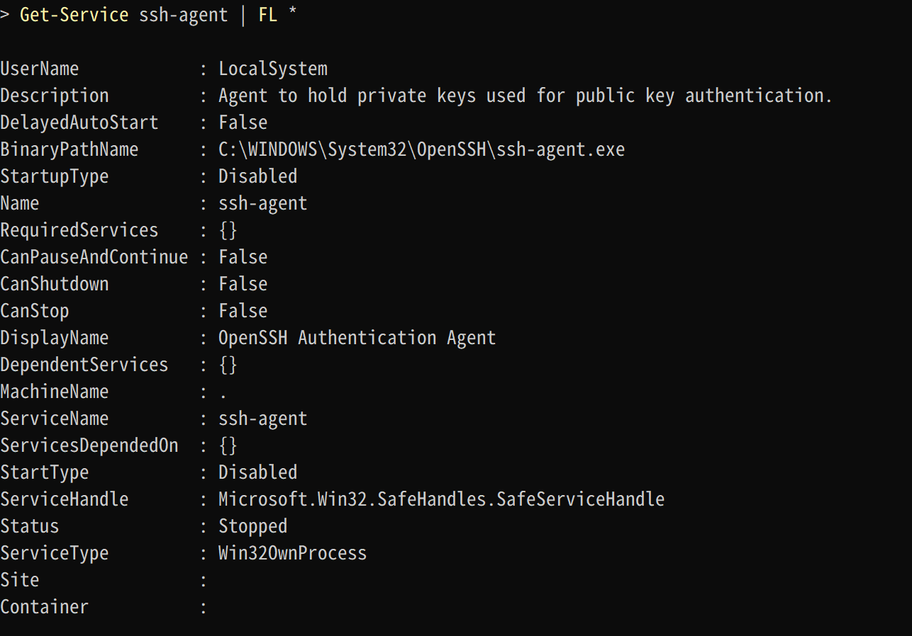
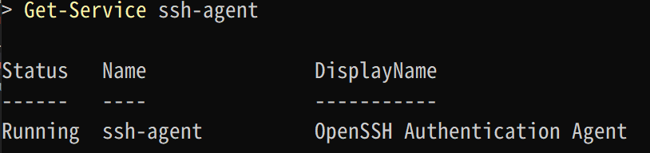

# 💎SSH Agent Forwardingをつかってみる（Windows 10）

ローカルPCからsshで多段階接続する際に、それぞれのサーバに秘密鍵を置くのは面倒ですし、管理上もセキュリティ上でも嫌な事が多いかと思います。
（ローカルPC -> HostA -> HostB という具合に多段接続するケース）

そのような状況を解決するにはSSH Agent Forwardingを利用します。

上記の例ではローカルPC上のssh-agentにHostBで利用する秘密鍵を登録する事により、接続先サーバに秘密鍵を置く必要がなくなります。
これはssh-agentが登録された秘密鍵を接続先のHostAでも利用できるようにうまいこと動作してくれます。

なお今回の対象環境はWindows 10 1909。

## ローカルPCでssh-agentのサービス確認

ssh-agentを利用するにはサービスが起動している必要があります。

PowerShellでssh-agentのサービスの状態を確認します。

```PowerShell
# ssh-agentの状態を確認
Get-Service ssh-agent | FL *
```



サービスが起動している場合は問題ありませんが、起動してない場合はStartupTypeがDisabledではなくManual（手動）かAutomatic（自動）にしてサービスをスタートします。
管理者実行したPowerShellで下記を実行して下さい。

```PowerShell
# スタートタイプを手動に設定
Set-Service ssh-agent -StartupType Manual

# ssh-agentサービスをスタート
Start-Service ssh-agent
```

runningになっていればOK。



## 秘密鍵の登録

ssh-add コマンドを利用して秘密鍵を登録します。

ローカルPC -> HostA -> HostB という具合に多段接続するケースを想定しており。
ここで登録する秘密鍵としては、
HostBへssh接続する際に必要な秘密鍵となります。

```PowerShell
# 秘密鍵の登録
ssh-add 秘密鍵のパス

# 登録された秘密鍵の確認
ssh-add -l
```

ちなみにssh-addコマンドのヘルプをみると下記のようなパラメータがある感じ。

```PowerShell
> ssh-add -h > Set-Clipboard
unknown option -- h
usage: ssh-add [options] [file ...]
Options:
  -l          List fingerprints of all identities.
  -E hash     Specify hash algorithm used for fingerprints.
  -L          List public key parameters of all identities.
  -k          Load only keys and not certificates.
  -c          Require confirmation to sign using identities
  -m minleft  Maxsign is only changed if less than minleft are left (for XMSS)
  -M maxsign  Maximum number of signatures allowed (for XMSS)
  -t life     Set lifetime (in seconds) when adding identities.
  -d          Delete identity.
  -D          Delete all identities.
  -x          Lock agent.
  -X          Unlock agent.
  -s pkcs11   Add keys from PKCS#11 provider.
  -e pkcs11   Remove keys provided by PKCS#11 provider.
  -q          Be quiet after a successful operation.
```

## ssh -Aオプションで一段回目のホストにssh接続する

-A オプションを利用してssh接続することで、ForwardAgentが有効となります。
このように接続する事で、ssh-agentに登録した鍵を接続のホストでも利用できるよううまいことやってくれる。

```shell
ssh -A <<username>@<<host>> -i <<秘密鍵のパス>>
```

なお`~/.ssh\config`に記載する場合は、

下記のようにForwardAgent yesとして設定して上げればAオプションを指定する必要はなくなり常に対象ホストに接続する際はForwardAgentが有効になります。

```config
Host 識別名
  Hostname ホスト
  User ユーザ
  IdentityFile 秘密鍵のパス
  ForwardAgent yes
```

## SSH接続先のホストから更に先のホストへ接続

ssh-agentが登録された秘密鍵を接続先のHostでも利用できるようになっているため。
下記のように実行すれば、登録された秘密鍵を利用してssh接続してくれます。

```shell
ssh <<username>>@<<host>>
```

今回のケースではHostBで多段接続が終わるのでAオプションはつけていませんが、さらにHostC -> HostD と多段が続く場合は下記のようにAオプションをつけて秘密鍵を連携して下さい。

```PowerShell
ssh -A <<username>>@<<host>>
```

## 総評

まずはbastionに接続し、目的地が更にその先にある場合はssh-agentのForwardAgent機能を利用すると便利かと思います。
